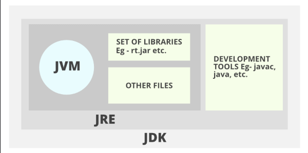
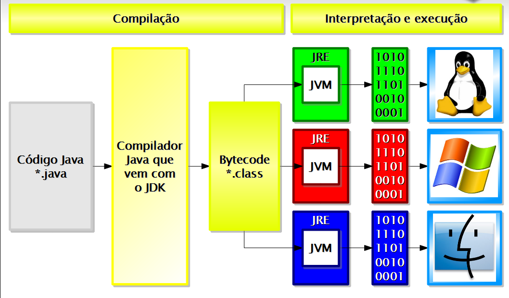

## Compilação

- O código é escrito em java, que é compilador através do javac, 
fazendo ele ser em um .class que está em bytecode, 
depois ele é lido pelo JRE (Java RunTime Enviromment) que contêm a JVM (Java Virtual Machine)

- O JVM é considerado multiplaforma devido que utiliza o conceito de Virtual Machine, 
porque a JVM intermedia a execução do código, 
possibilitando que programa java funcionarem em qualquer plataforma.