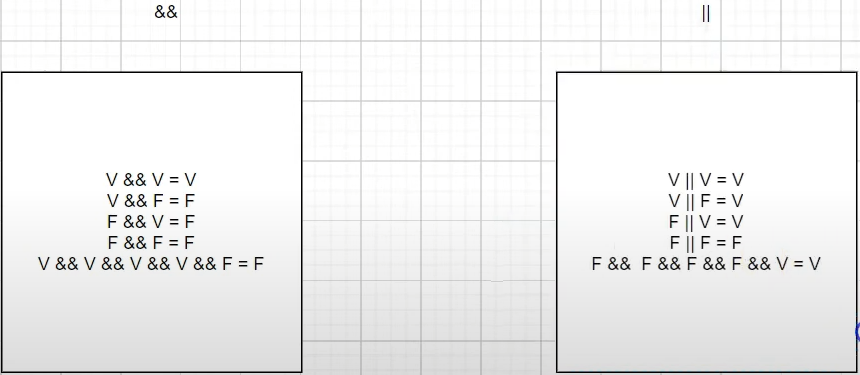

## Aula 04 - Estruturas Condicionais

### If

- Significa “se”
- Faça algo **se** algo acontecer
- Obrigatoriamente o resultado retornado precisa ser um booleano
<br><br>
**Sintaxe**

    ```java
    if (condição) {}
    ```


### Else if

- Significa “se não”
- Faça algo se algo existiu **se não** algo outra coisa
  <br><br>
  **Sintaxe**

    ```java
    if (condição) {
    
    } else if (outra condição) {
    
    } else {
    
    }
    ```


### Operador ternário

- Foi criado para simplificar condições if else, quando se precisar fazer associação diretamente a uma variável
  <br><br>
  **Sintaxe**

    ```java
    String resultado = (condição) ? verdadeiro : falso;
    ```


### Tabela Verdade

- É o que vai definir o que se vai ter como resultado de uma expressão booleana quando se tem mais de uma condição



### Switch

- Usada para executar um bloco de código entre várias alternativas.
- Dentro do Switch, somente se coloca
    - char
    - int
    - byte
    - short
    - enum
    - String

<br><br>
**Sintaxe**
  ```java
    switch(varivel) {
    case(condição):
   ```