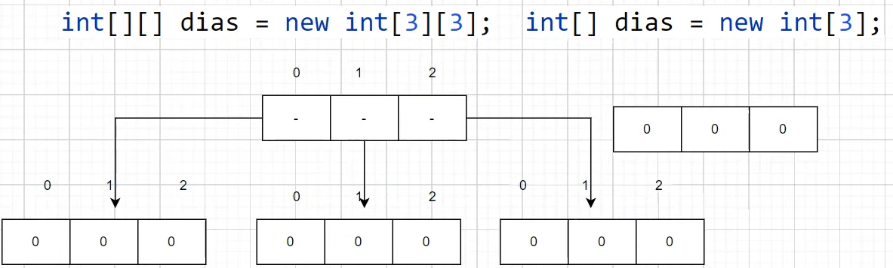

## Aula 07 - Arrays Multidimensionais

### Definição

- São arrays de arrays, ou seja, arrays linkados
<br><br>
**Sintaxe**

    ```java
    (tipo primitivo) [][] (variável) = (referencia);
    ```

    Exemplo

    ```java
    int [][] dias = new int[12][];
    ```

- Quando inicializada, é necessário definir o tamanho do array base, mas os arrays em seguida não precisam agora

### Explicação



`[[0,0,0], [0,0,0], [0,0,0]]`

### Inicialização

- Caso tente printar um

    ```java
    int [][] arrayInt = new int[3][];
    ```

- Dará erro (NullPointerException), esse erro acontece quando se tenta executar algo no código, algo que não existe, porque temos um array de 3 posições que não faz referência a nada
- Variável de referência, o padrão é null, um array é sempre um variável de referência (um objeto), porque estamos iniciando um array de arrays.
<br><br>
- Para inicializar um array dentro de outro:

```java
(arrayBase)[posição] = new (tipoPrimitivo)[posições]
```

```java
arrayInt[0] = new int[2];
```