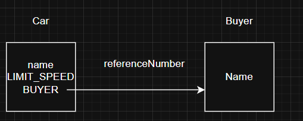

## Aula 17 - Orientação a Objetos - Modificador Final

### Introdução

- Um valor que não será alterado
- Versão do Java para um constante.
- Definida pela palavra “final”
- Tem um conversão própria
    - Tudo em Uppercase, Separada por underscore “_”

### Tipo primitivo

- **Sintaxe**

    ```java
    (acessModifier) final (variável) = (valor);
    ```

    - O valor pode ser atributo também dentro do bloco de inicialização ou do construtor

    ```java
    public static final LIMIT_VELOCITY = 250;
    ```

    - Geralmente vem junto ao método static

### Tipo Referência

- **Sintaxe**

    ```java
    (acessModifier) final (Class) (variável) = new (construtor);
    ```

    ```java
    public final Buyer BUYER = new Buyer();
    ```




- Uma variável final não pode ter a referência alterada
- Porém os dados dentro do objetos podem ser alterados
- Singleton pattern

### Classes e métodos

- Colocar final em uma classe faz com que ela não possa ser estendida
- Métodos com final não podem ser sobrescritos