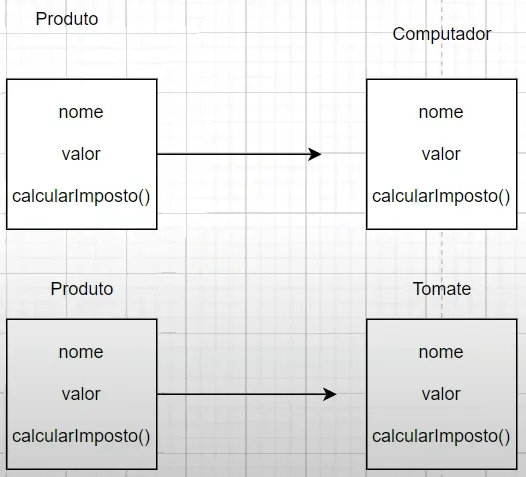
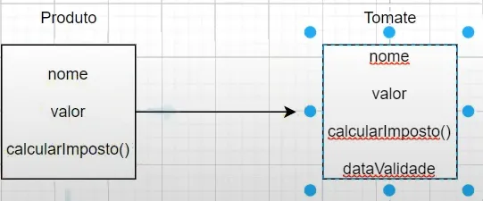
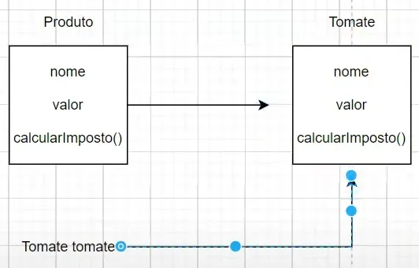

## Aula 21 - Orientação a Objetos - Polimorfismo

### Introdução

- Quando se trabalha com arquitetura MVC, se separa o Modelo (dominio) do controller
- Basicamente, separa a regra de négocio do dominio com o que será visualizado
- Exemplo:
    - Visualiza → Teste;
    - Modelo → Dominio;
    - Regra de négocio → Serviço

### Funcionamento

- Polimorfismo significa múltiplas formas
- Significa que se pode trocar o tipo da variável de referência, mas ainda continuar utilizando outros objetos, isso so é aplicado na herança
- É a capacidade de uma classe que tem uma superclasse, assumir certo comportamento dessa classe
    - Exemplo: `TaxCalculator`
    - Quem implementa produto, pode entrar em um método que peça um produto
- A finalidade de polimorfismo é reutilização de código
<br><br>
- Exemplo: `ProductTest2`

  **Widening Cast**

    - Cast mais amplo, passando um objeto mais específico para um objeto/referência mais genérica

    ```java
    (SuperClasse) (variável) = new (SubClasse);
    ```

  
    
  ---

  

  Produto não pode executa `dataValidade` porque dataValidade é algo específico da subclasse e nunca poderá ser acessado pelo produto

  Pois a garantia que a herança proporciona é de que todos os atributos que se tem na superclasse podem ser chamados na subclasse porque serão herdados


### Parâmetros polimórficos

- Através to polimorfismo, pode-se criar um único método responsável por todas as subClasse herdadas da superClasse
    - Exemplo: `TaxCalculator`

### Cast e Instanceof

**Narrowing Cast**

- Contrário do wideling cast
<br><br>
- Exemplo: `ProductTest3`

  


### Programação orientada a Interface

- O padrão que se tem em alguns framework como o spring, geralmente o lugar onde se pega os dados de banco de dados de um arquivo é chamado de repositório

- Exemplo: `RepositoryTest`
    - Ao invés de colocar o tipo específico, se coloca o genérico

    ```java
    (Interface) (variável) = new (Classe);
    ```

    - Fazer isso aumenta a manutenabilidade e a escalabilidade do código