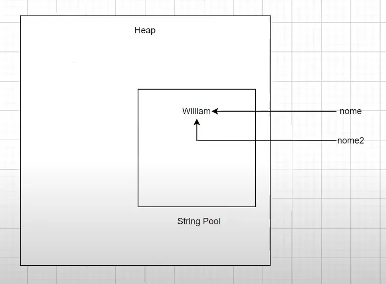

## Aula 24 - Classes Utilitárias - Strings

### Introdução

- Strings no java são imutáveis
- String interning: Basicamente quando se utiliza as Strings de forma imutável, ou seja, o quando se criar a string pela primeira vez, ela será alocada na String Pool, mas caso crie uma segunda vez, o java não vai duplicar, ele só vai de retornar a referência daquele valor

    

- Quando se quer comparar a referência de um objeto, se utilizar `==`.
- Por causa da imutabilidade das Strings, há não ser que se faça uma nova associação, não se pode trocar o valor que existe.

  

- Nunca consegue alterar um valor no pool de Strings.
- Quando se está trabalhando com String literal, se está pegando diretamente da String pool.
- Porém quando se cria um objeto, a variável de referência está fazendo a referência para o objeto.
- Alguns métodos de String: `StringTest2`.

### Desempenho

- A performance das Strings conforme se aumenta o tamanho da quantidade de Strings únicas que se precisa no sistema, a performance vai diminuindo, precisando de mais tempo.
- String Buffer: criado para ser usado em ambientes com acesso de múltiplas threads ao mesmo recurso.

### StringBuilder

- É meio que uma forma manipulável de lidar com um string.
- É uma classe que vai trabalhar com as Strings.
- Não se tem o conceito de string imutável quando se trabalha com StringBuilder, porque StringBuilder não é uma String.
- A principal diferença é até o momento que ela se transforma em um String, ela não existe.
- Tudo que se aplica o StringBuilder, também se aplica a StringBuffer.
- Para adicionar uma string ao StringBuilder, se utiliza o método `append()`.
- Uma das razões que a performance da StringBuilder ser maior String é justamente pela capacidade de que o StringBuilder oferece de fazer a mudança da String sem precisar ficar alocando um novo espaço no String pool, porém aumenta a complexidade.