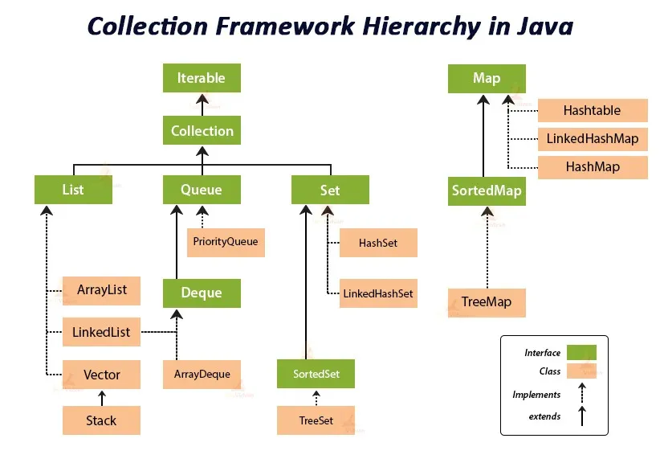
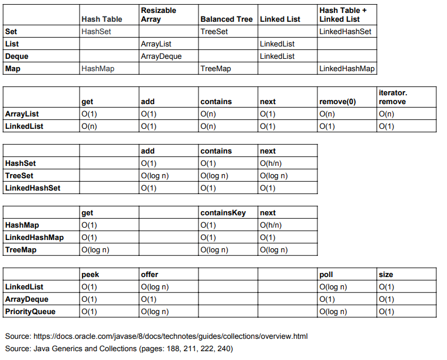
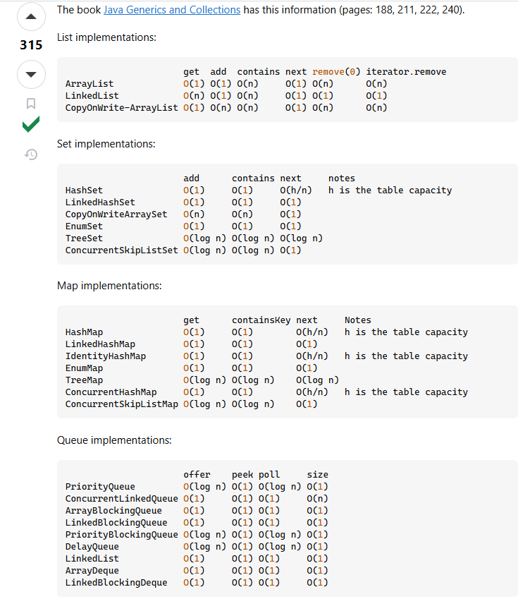
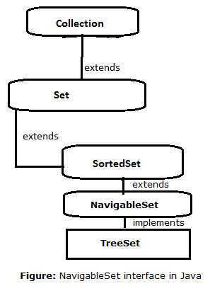
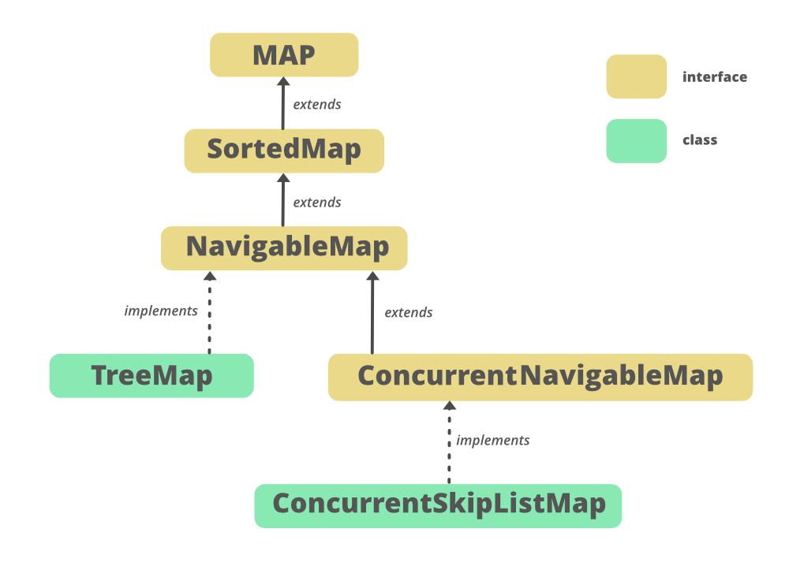

## Aula 31 - Collections

### Equals

- Quando se usar `==` a JVM não está comparando o valor do objeto, é sim da referência.
- `.equals` compara o valor do objeto.
- Existem regras definidas no método equals (está presente na documentação do método):
    - Reflexivo: `x.equals(x)` tem que ser true para tudo que for diferente de null.
    - Simétrico: para x e y diferentes de null, se `x.equals(y) == true`, logo  `y.equals(x) == true`.
    - Transitividade: para x,y,z diferentes de null, se `x.equals(y) == true`, logo `x.equals(z) == true`, logo `y.equals(z) == true`.
    - Consistente: `x.equals(x)` sempre retorna true se x for diferente de null.
    - para x diferentes de null, `x.equals(null)` tem que retornar false.

### hashCode

- hash é um valor numérico gerado para identificar um valor.
- Existem regras definidas no método hashCode:
    - se `x.equals(y) == true`, `y.hashCode() == x.hashCode()`.
    - `y.hashCode() == x.hashCode` não necessariamente o equals de `y.equals(x)` tem que ser true.
    - `y.hashCode() != x.hashCode()`, `x.equals(y)` deverá ser false.
- O atributo gera o equals tem que ser o mesmo que gera o hashCode para manter a consistência.

### Complexidade Big-O

- Collections no java é um grupo de dados divididos em diferentes classes que se enquadram em 2 categorias
    - Ordered  -> algo é ordenando quando a JVM lembra a ordem dos elementos
    - Sorted -> a ordem é baseada em algo pré definido

  

- Quando se trabalha com collection, se trabalha orientado a interface.
- Baseado na implementação que se está utilizando, se terá um diferença em performance.
- Big-O basicamente define a velocidade baseado no tipo de operação que se está fazendo.

https://www.bigocheatsheet.com/

- Quando se fala de Big-O sempre se olha o pior-caso (Worst-case).

  
  
  https://stackoverflow.com/questions/559839/big-o-summary-for-java-collections-framework-implementations
- Quando se está trabalhando com collections tem que se ter cuidado com complexidade Big-O e cada coleção tem um tipo de complexidade para operação.

## List

- Um ArrayList é basicamente um array que pode ser dinamicamente incrementado.
- É uma lista ordenada
- No momento de criação de qualquer collection, o valor dentro da operador diamante (<>) tem que ser um objeto.
- Não se pode criar uma List com um valor primitivo;

## Sorting

- Exemplo: `ListSortTest`

**Comparable**

- Para ordenar classe customizada é necessário implementar a interface Comparable e sobreescrever o método compareTo da forma que queremos que seja ordenado.
- Exemplo: `MangaSortTest`

**Comparator**

- Essa interface tem o método compare e não se implementa na sua classe diretamente
- Exemplo: `MangaSortTest`

## Binary Search

- Forma de fazer busca que retorna a posição(Index) do elemento desejado, ou caso não seja encontrado, retorna (-(ponto de inserção) -1)
- Ele precisa que a lista já esteja ordenada.

## Conversão de Lista para Arrays e vice versa

- Quando se cria uma nova list usando como referência um `Arrays.asList()` se cria um link do array com list, fazendo com que qualquer alteração feita via `.set` seja feita também no array.
- Caso tente usar `.add`, será lançando uma exception.
- Porém, quando se cria uma list, instância uma arrayList e parando via parâmetro o `Arrays.asList()`, é possível utilizar o `.add`, porque o array não estará linkado a list.
- É um possível criar uma list diretamente usando o `Arrays.asList()` e passando os valores via argumento, por que o parâmetro do método um varArgs.
  - Outra maneira é usando o `List.of`, porém somente funcionar no Java 11+.

## Iterator

- É uma classe que checka antes de fazer alguma ação.
- É um objeto que permite percorrer elementos baseada em alguma condição.

## Set, HashSet

- Set é um interface que extende de collection.

  

- Tem como vantagem não permitir elementos duplicados dentro da coleção.
- HashSet é um coleção onde permite apenas elementos únicos e que serão organizados pelo Hash.
- Set não é indexado, ou seja, não tem index, ou seja, não tem como dar get() em um index.
- Antes de inserir um novo elemento na lista, o java irá checar através do método `equals()`.para prevenir elementos duplicados.
  - Devido a isso, é importante ter um método equals sobrescrito e bem definido.
- HashSet não manter a ordem de inserção, para isso se pode usar o LinkedHashSet, que criará um LinkedList com Set

## NavigableSet, TreeSet

- Faz parte do SortedSet que implemeta de um Set, porém nele falha no contrato do Set, ou seja, não utiliza o equals para ver se dois elementos são iguais.
  - Se basea no método compareTo.
- NavigableSet basicamente adiciona alguns métodos que pegam elementos baseado em posições já existentes
- NavigableSet implementa a class TreeSet
- Geralmente classe que tem o nome tree vai trabalhar diretamente linkado a parte de se ter o sort.
  - Ou seja, ela precisa que as classes adicionadas dentro da coleção tree, tem que se ter certeza que elas tem o comparable.
  - Caso o comparable não seja implementa dentro da classe, pode-se implementar o comparable em uma outra classe dentro do arquivo que ela esta sendo chamada.

      ```java
      class SmartphoneBrandComparator implements Comparator<Smartphone> {
      
          @Override
          public int compare(Smartphone o1, Smartphone o2) {
              return o1.getBrand().compareTo(o2.getBrand());
          }
      }
      ```

      ```java
      NavigableSet<Smartphone> set = new TreeSet<>(new SmartphoneBrandComparator());
      ```

- Ou seja, para usar o NavigableSet é necessário ter um classe que implementa o comparable, ou quando se passa um Comparator dentro do argumento do treeSet.
- O TreeSet automaticamente faz a organização da coleção baseado no compareTo passado.
- Se utilizando o TreeSet quando a classe que se está criando a coleção implementa comparable (ou quando se está criando um comparator), é sempre que inserido um elemento novo, o TreeSet reorganização a coleção baseado no compareTo (comparable) ou no compare(comparator).
- Alguns métodos:
  - lower < imediatamente menor
  - floor <= retorna o mesmo elemento, ou caso não exista, o imediato abaixo dele
  - higher > imediatamente maior
  - ceiling >= valor igual a ele ou maior
  - pollFirst: retorna e remove o primeiro elemento da lista
  - pollLast: retorna e remove o ultimo elemento da lista

## Map, HashMap, LinkedHashMap

- Tecnicamente, Map não é uma collection.
- Sintaxe:

    ```java
    Map<K, V> var
    ```

  - K: Key // Chave.
  - V: Value // Valor.
- HashMap: Ordem as chaves baseada no Hash.
- Precisa do equals e o hashCode implementado, porque uma regra do Map é que não se pode ter chaves duplicadas.
- Caso tente colocar 2 chaves igual, a ultima irá sobrescrever a primeira.
- Para navegar dentro do map, pode-se usar tanto chave quanto o valor.
  - Chave é um set, por isso, não se pode ter elementos duplicados, usamos o método `keySet()`.
  - Valor retorna um tipo mais genérico (Collections <E>), pode-se ter dois valores iguais.
  - Usando `Map.Entry<>`

## NavigableMap, TreeMap



- Aplica as mesmas regras do Map.
- Segue a mesma lógica de NavigableSet do comparable e comparator.

## Queue, PriorityQueue

- Tem como característica FIFO - First In, First Out, ou seja, uma fila.
- Parece com sorted, porque quando se está adicionando a classe, ela precisa ser um comparable.
- A classe PriorityQueue foi criada para trabalhar com prioridades customizadas.
- A PriorityQueue irá manter a ordem, mas não quanto tiver os objetos em memória (dentro do Heap), mas quando se tirar os valores, eles retornaram ordenados que foi definida no comparable ou comparator.
<br><br>
- Peek: Sempre te mostra o primeiro elemento.
- Poll: retorna o primeiro elemento e o remove.
- Offer: parecido com add, a diferença é que offer retorna um booleano caso não consigo inserir em uma queue com capacidade restrita, e o add retorna um exceção.