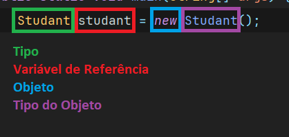

## Aula 8 - Orientação a Objetos - Classes

### Introdução

- A orientação a objeto foi criada para mapear o mundo real para o mundo computacional
- Dados agrupados dentro de um valor maior
- O agrupamento é o objeto, onde temos diferentes dados guardados dentro de um único espaço em memória, mas todos eles estão relacionados ao mesmo objeto
- É basicamente uma forma que vai conter atributos que darão a origem a um objeto
<br><br>
- O método main é o ponto de entrada para executar as classes

### domain / model

```java
public class (ClassName) {
	(tipoPrimitivo) (nomeDoAtributos)
}
```

- As classes que geralmente representam sua lógica de negócio

**Sintaxe:**

```java
(NomeDoObjeto) (nomeDaVariável);
```

```java
Studant studant;
```

- Se tem uma variável de referência do tipo Studant, para criar objetos se sempre precisará utilizar o new, em seguida o tipo do objeto que se quer criar

```java
Studant studant = new Studant();
```

- Aqui nos temos um variável de referência(studant) do tipo Studant que está fazendo referência para um objeto do tipo Studant



```java
studant.age;
```

- Significa que está acessando diretamente um atributo da classe

### Coesão

- Propósito da classes
- Quando se diz que um código é altamente coeso significa que as classes não estão misturando o propósito delas de existirem
- De preferência, um propósito por classe