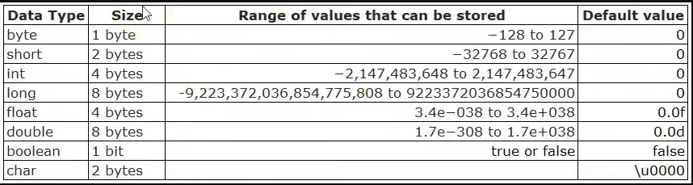

## Aula 2 - Tipos Primitivos

### Declaração e tamanho em memória

- Tipos primitivos são os tipos que vão guardar em memória um valor simples
<br><br>
- Existem 8 tipos de tipos primitivos
    - int
    - double
    - float
    - char
    - byte
    - short
    - long
    - boolean
<br><br>
- Pela conversão, devem ser escritas em Camel Case
    - myExample
<br><br>
- Todos os tipos primitivos, com a exceção do boolean, são numéricos
- A diferença entre eles é a quantidade de valor que se pode colocar dentro da variável (dentro do espaço em memória)



### Definição

- long e int → números inteiros
- double e float → números decimais
- byte, short, long → valor número
- char → traduz para a tabela ASCII e unicode

    ```java
    char asciiA = 65;
    char unicodeA = '\u0041';
    ```

- Quando se coloca um número decimal direto no código, o java considera isso como um double
    - Para evitar isso se colocar no float, um “f” ao final no número

    ```java
    double salarioDouble = 2000.0;
    float salarioFloat = 2500.0F;
    ```

- Quando se coloca um número inteiro direto no código, o java considera isso como um int
    - Para evitar isso se colocar no long, um “l” ao final no número

    ```java
    int age = 10;
    long numeroGrande = 100000L;
    ```


### Casting

- Forçar um valor de um variável dentro da outra
    ```java
    long numeroGrande = (long) 155.23;
    ```
    - Vai imprimir só 155 porque o long não suporta números decimais

### String

- Não é um tipo primitivo. String no Java é um objeto do tipo String