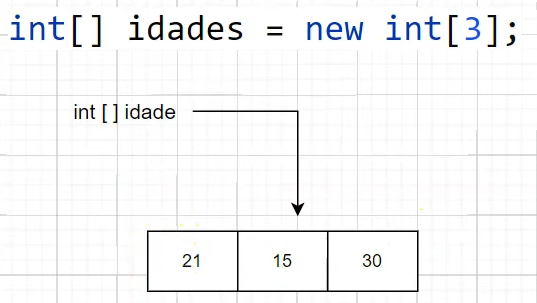
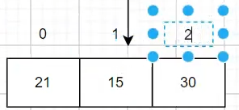
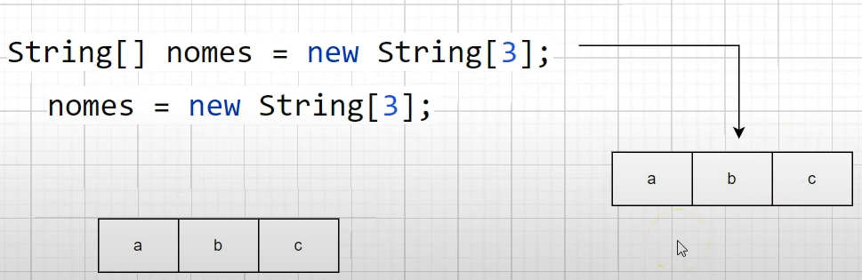

### Definição

- Arrays são referências para um espaço em memória mais de um valor
- É uma referência para os objetos em memória juntos
<br><br>
**Sintaxe**

    ```java
    (tipo primitivo) [] (variável) = (referencia);
    ```

  Exemplo

    ```java
    // A variável será iniciada porém sem referência.
    int [] idades = null;
    
    /* A variável será iniciada
    fazendo referência a quantidade de espaço na memória que será alocada */
    int [] idades = new int[3];
    ```


### Inicialização

- Colocar só `int [] idades` não se criará um array, pois a variável não foi inicializada
    - `int[]` → é uma variável do tipo reference
    - `idades` → é um objeto, um array é sempre um objeto



- Arrays são indexados, ou seja, tem posições
- O index sempre começa em 0



### Valores

- Caso dê print no array, será retornado um endereço de memória
<br><br>
- O valor padrão de inicialização de qualquer array de tipo primitivo é 0 ou 0.0, e de String é null
- As mesmas regras dos tipos primitivos são aplicadas as arrays
    - Exemplo, tentar colocar decimais em um int

**Valores Padrões**

- 0
    - byte
    - short
    - int
    - long
    - float
    - double
<br><br>
- = ‘/u0000’ ‘ ‘ espaço em branco
    - char
<br><br>
- boolean
    - false
<br><br>
- String
    - null
<br><br>
- Caso de uma nova referência a um array ja inicializado, ele perderá a referência anterior, e não poderá se mais recuperada (será deletada eventualmente pelo garbage collector)

  


- Existe uma forma de inicializar um array com tamanho e diretamente com os valores

```java
(tipo primitivo) [] (variável) = ({valores});
(tipo primitivo) [] (variável) = (referencia){valores};
```

```java
int [] number = {1,2,3,4,5};
int [] numbers2 = new int[]{1, 2, 3, 4, 5};
```

### foreach

```java
for((variável local):(array))
```

```java
for(int i:numbers2) {
	System.out.println(i);
}
```

- Ao invés de pegar o index de cada valor dentro do array, com foreach se estar pegando diretamente o valor dele.