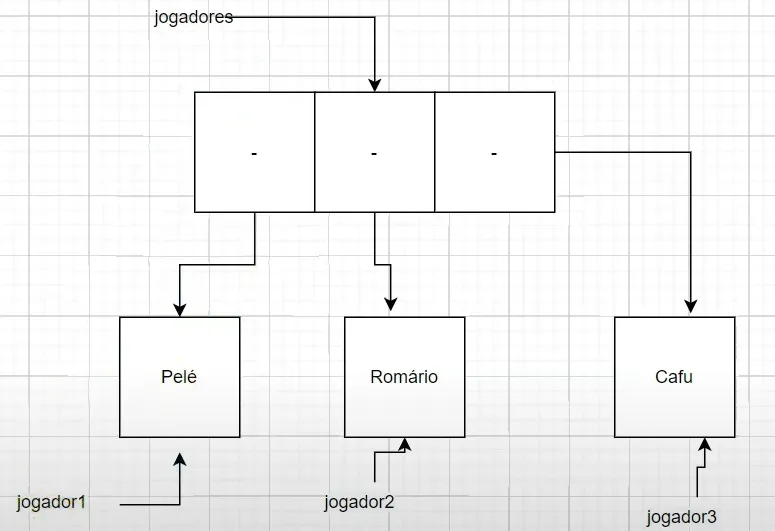
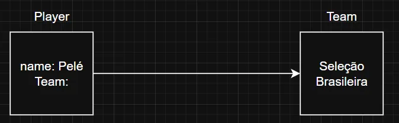
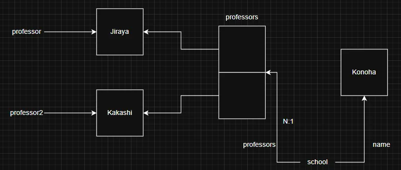
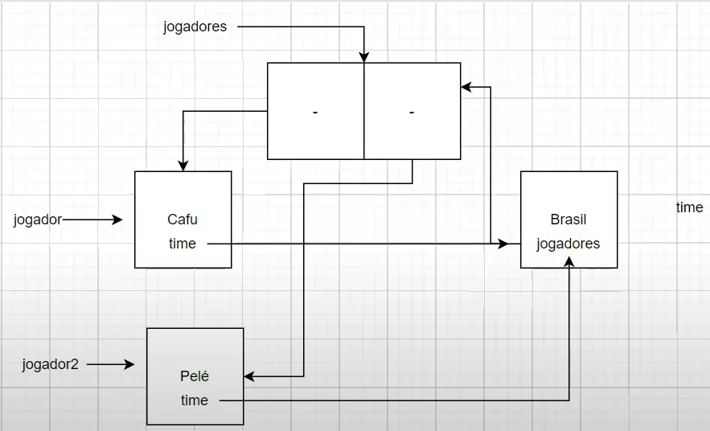
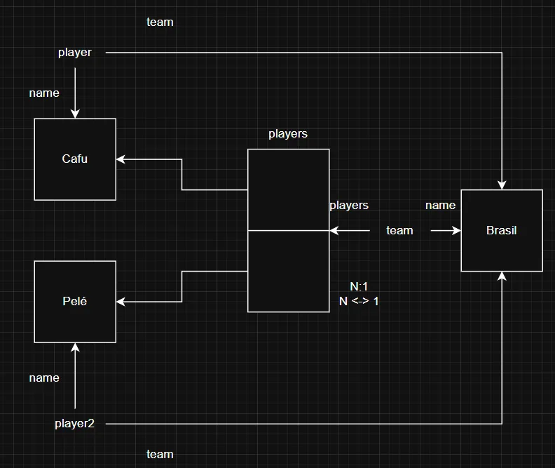

## Associação

### Arrays com Objetos

- **Sintaxe**

    ```java
    (Tipo) (Variável) = new (Variável)[tamanho];
    ```

    ```java
    Jogadro[] jogadores = {jogador1, jogador2, jogador3};
    ```

- Cada elemento do array faz referência ao seu objeto relacionado

  


### Associações

- Associação é o relacionamento entre dois objetos

**Tipos**

- 1:1
- 1:N
- N:1
- N:N

**Exemplos**

- Jogador 1 -- 1 Personagem
- Time 1 -- N Jogador
- Jogador N -- 1 Time
- Estudante N -- N Curso

### Associação unidirecional um para muitos

- 1 → N
- Exemplo: `PlayerTest2`
    - Um jogador pode ter 1 time, e o time não tem conhecimento do jogador

  


### Associação unidirecional muitos para um

- N → 1
- Exemplo: `SchoolTest`

  

  


### Associação bidirecional

- 1 ↔ N ou N ↔ 1
- Exemplo: `PlayerTest3`

  

  


### Leitura de dados pelo console

- Classe Scanner - package util
- **Sintaxe**

    ```java
    Scanner input = new Scanner(System.in);
    ```

- Há vários métodos de leitura

### Exercício Associação

- Crie um sistema que gerencie seminários
    <br><br>
    O sistema deverá cadastrar seminários, estudantes, professores e local onde será realizado
  <br><br>
    Um aluno poderá estar em apenas um seminário

    Um seminário poderá ter nenhum ou vários alunos

    Um professor poderá ministrar vários seminários

    Um seminário deve ter um local
  <br><br>
    Campos básicos (excluindo relacionamento)

    seminário: título

    aluno: nome e idade

    professor: nome, especialidade

    local: endereço