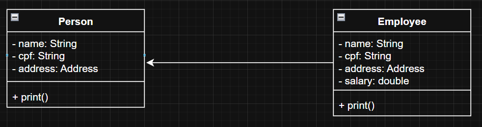

## Aula 15 - Orientação a Objetos - Herança

### Introdução

- O termo “tem” quando trabalhamos com associação significa que se tem um relacionamento entre eles
- A herança se usa o termo “é”
    - O funcionário é uma pessoa (ele é tudo que uma pessoa é + alguma coisa)
- Extensão das funcionalidades de alguma classe
- Se utiliza herança quando se quer extender a funcionalidade de uma classe é manter um relacionamento entre elas
- Ou quando se quer usar polimorfismo
- Classes herdada herdam os atributos e os métodos

  

- Herança múltipla não existe no Java, não se pode extender mais de uma classe

### Super

- Também chamado de sobrescrita, basicamente escreve o método com a mesma assinatura, exatamente igual a classe pai (ou classe mãe, super classe) tem
- Executa o método da classe pai, em seguida a classe filha
    - coloca “super” dentro do método na classe filha

    ```java
    public void print() {
        super.print();
        System.out.println("Salário: " + this.salary);
    }
    ```


### Protected

- private: Só podem ser acessados dentro do objeto (mesma classe)
- protected: Só pode ser acessado por classe dentro do mesmo pacote, classe e subclasse
- public: Qualquer classe pode acessar o atributo
- default: Só pode ser acessado por classe dentro do mesmo pacote e classe

### Construtores

- Subclasses tem que respeitar a regras de construtores das superclasses

### Sequência de inicialização

1. Bloco de inicialização estático - Super Classe
2. Bloco de inicialização estático - Sub Classe
3. Todos os Blocos de inicialização da Super Classe
4. Todos os construtores da Super Classe
5. Todos os Blocos de inicialização da Sub Classe
6. Todos os construtores da Sub Classe

    ```markdown
    Dentro do bloco de inicialização estático de Person
    Dentro do bloco de inicialização estático de Employee
    Dentro do bloco de inicialização de Person
    Dentro do bloco de inicialização de Person
    Dentro do construtor de Person
    Dentro do bloco de inicialização de Employee
    Dentro do bloco de inicialização de Employee
    Demtro do construtor de Employee0
    ```