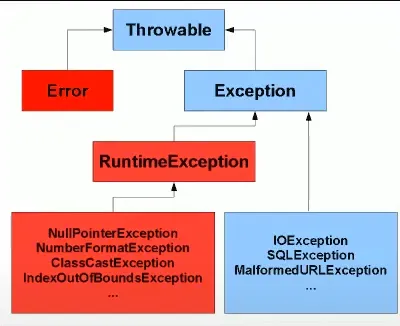
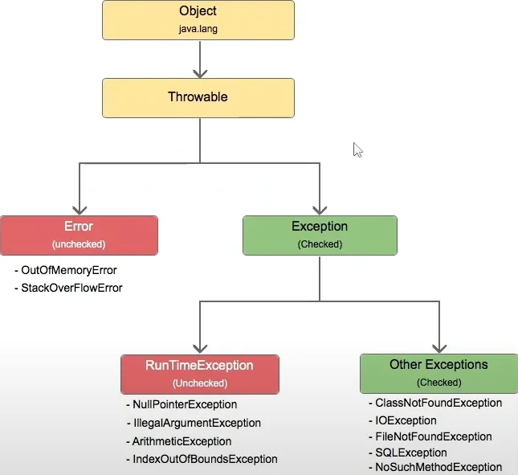
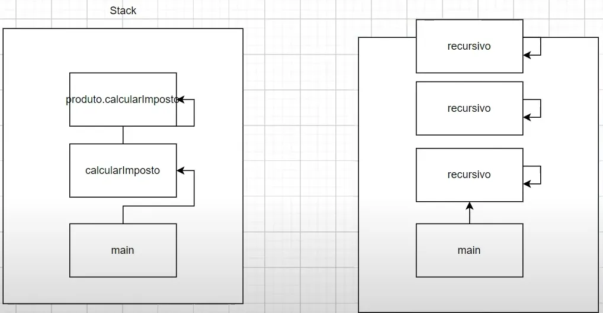

## Aula 22 - Exceções

### Introdução

- Exceções são condições anormais do programa
- Basicamente são formas que se trata o comportamentos inesperados da execução de código

  

  

- As exceções no java (como tudo) são objetos
- Todas as exceções do java são da classe throwable
- De um forma de técnica, error e exception são coisas diferentes
- Quando se fala que acontece um error, o error que foi lançado é uma subclasse de error
- Quando se fala que  se lançou uma exceção, são subclasses de exception

### Errors

- Errors são situações onde não se tem como recuperar / são impossíveis de se recuperar em tempo de execução
- Ou seja, se tem que parar o programa, resolver o problema, e em seguida iniciar novamente
- Geralmente quando se tem um error, a JVM para de executar

**StackOverflow**

- Ocorre quando acaba a memória da stack de chamadas do método

  

    - Exemplo: `StackOverflowTest`

### RuntimeException

- Tem exceções que são checked e unchecked (checadas e não checadas)
- Exceções do tipo checked são exceções que são filhas da classe exception diretamente, e essas exceções se não tratadas, elas vão lançar um erro em tempo de compilação
    - Ou seja, nem se é possível de compilar o código
- Exceções unchecked são exceções que são filhas ou incluem na classe RuntimeException, que quando lançadas pelo programa, quase sempre o problema é no código
- RuntimeExceptions são do tipo unchecked, não é obrigatório fazer o tratamento, e quando se tem as checked exceptions obrigatoriamente é preciso fazer o tratamento, caso não o faça, o código não compila
- Exemplo: `RuntimeExceptionTest`

### Exception

- Quando se checked exception não tratada, o código vai compilará. Com isso, o java força a fazer um tratativa, caso não faça, a JVM não deixará compila o código
- **Sintaxe:**

    ```java
    try {
    
    } catch (Exception exception) {
    
    }
    ```

    - Basicamente, tenta executar esse pedaço de código, e caso lance um exceção, pega a exceção
    - No catch, se tem que disse o que se estar querendo pegar (e escrever como se fosse um método)
        - O java quando lançar um exceção, ele vai criar um objeto, e referenciará o objeto na instanciação
- Todas as vezes que se estiver trabalhando com as subclasse de Exception, sem ter Runtime, é preciso obrigatoriamente ter o código que existe a possibilidade de lançar
- Se pode colocar somente a classe Exception no catch block, assim tratando todas as exceções, porém as boas práticas dizem que se tem que capturar a exceções mais específicas, porque se pode oferecer um tratamento melhor
- Evitar colocar lógica de negócio no catch block, o catch é feito para lidar com exceções
- Exemplo: `ExceptionTest`

### Lançando exceção unchecked

- Exemplo: `RuntimeExceptionTest2`
- Se pode tratar unchecked exceptions sem o uso do try catch, se pode lançar novas exceções utilizando o `throw new` com o objeto
- Exceções do tipo Runtime não precisam ter declaração na assinatura do método

### Lançando exceção checked

- Prós e contras do tratamento de exceção
    - Prós
        - Se está fazendo o tratamento de exceção, o código não vai parar de funcionar
    - Contras
        - Quem está chamando o método, ele não tem opção de fazer o tratamento de outra maneira
- Para o tratamento de exceções seja feito pelo método que está chamando, se coloca na assinatura do método chamado `throws` com a exceção declarada
<br><br>
- Quando se usar`throws Exception`, ou `try catch`?
    - Quando se estar criando um método privado, geralmente se usar o `try catch`. Porque o método privado, ninguém fora da classe pode chamá-lo
    - Quando se cria o método publico, não se sabe quem vai chama esse método, nesse caso, é interesse colocar o `throws Exception`, é cada método pode ter um visão diferente de como essa exceção pode ser tratada
    - Também se pode fazer algo híbrido, onde se captura a exceção e relança a exceção
- Exemplo: `ExceptionTest2`

### Bloco Finally

- Quando se precisa que algum pedaço de código seja executa independente da condição que está acontecendo dentro do `try catch`.
- Se pode colocar o `bloco finally` no try sem a necessidade de um `catch`.
- Exemplo: `RuntimeExceptionTest3`

### Capturando múltiplas exceções

- Existem casos onde um método vai lançar mais de um exceção.
- Nesse caso, se coloca múltiplos catchs.
- Não se pode colocar um tipo mais genérico a frente dos outros catches, devido a regra do polimorfismo, exceções mais genéricas tem que vir no final.
- Funciona tanto para subclasse de RuntimeException quanto para as Exception.
- Se pode colocar múltiplas throws na assinatura do método.
- Exemplo: `RuntimeExceptionTest4`

### Multi catch em linha

- Se pode colocar exceções que não estão na mesma linha de herança dentro um mesmo catch separados via pipe ( “|” ).
- Ao invés de colocar Exception como superClasse pelo polimorfismo se coloca múltiplas exception via Multi catch, para se ter um tratamento mais personalizado.
- Quando se utiliza do multi catch, o java basicamente transforma a variável em final, não podendo associar outro valor.
- Exemplo: `RuntimeExceptionTest4`

### Try with resources

- **Sintaxe:**

    ```java
    try (resource) {
    
    } catch (Exception exception) {
    
    }
    ```

- Só se pode colocar objetos dentro do try with resources que implementando a interface Closeable ou AutoCloseable.
- Se pode remover catch, porém se é obrigado a colocar o throws
- O java será responsável por chamar o `close()`, e eles são fechados na ordem inversa que foram declarados
- Exemplo: `TryWithResourceTest`

### Exceção customizada

- São exceções que se pode criar e definir o comportamento delas baseada na lógica de negócio do sistema
- Para criar uma exceção customizada, basta criar um classe e estender a classe Exception ou RuntimeException
    - É uma boa prática colocar Exception ao fim do nome da classe, para manter uma boa legibilidade
- Exemplo: `InvalidLoginExceptionTest`

### Exceção e regras de sobrescrita

- Quando se estar sobrescrevendo um método, não se obrigado a declarar as mesmas exceções que aquele método está declarando
- Porque a funcionalidade da sobrescrita que se está colocando pode ser completamente diferente
- Se pode lançar uma ou todas as exceções do método original
- Se pode adicionar qualquer exceções do tipo uncheck (Runtime)
- Não se pode colocar exceções mais genéricas ou do tipo checked (Exception) ao método sobrescrito
- Não se pode adicionar nenhum exceção do tipo checked (Exception) que não foi declarada no método original