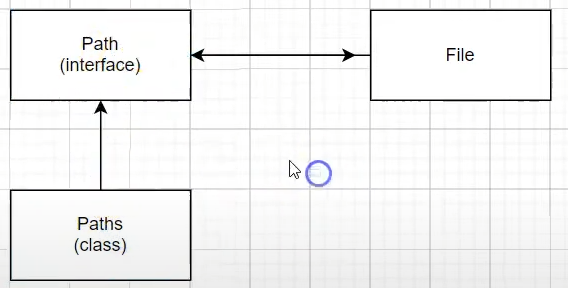
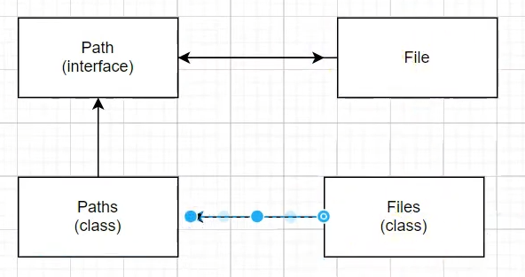

## Aula 29 - Classes Utilitárias - NIO

### Path, Paths, Files

- Path é uma interface que trabalha no lugar de File
- Foi criada para substituir o Java.File.
- Para criar um Path, precisa da classe Paths.

  

- E através da Paths (que se vai ter um Path), se utiliza a Files para trabalhar com aquele arquivo.

  