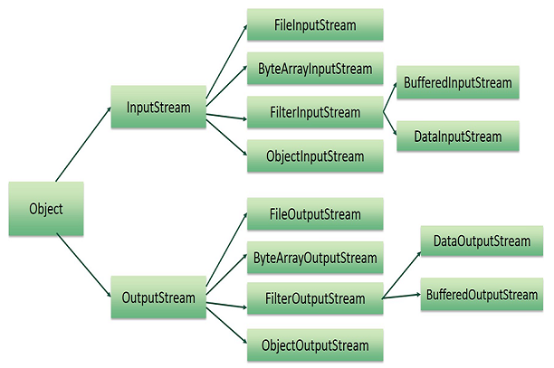

## Aula 30 - Classes Utilitárias - Serialization

- Transforma um objeto em uma sequência de bytes, que é usada para trafegar de um ponta para outra (entre objetos).
- Basicamente é um objeto que se tem em memória e persistir ele.
    - Exemplo: pega um objeto em memória e salvar esse objeto em memória em um arquivo e depois ler ele novamente.
- Caso de uso: muitos frameworks usam esse conceito por de baixo dos panos, salvar o estado de um objeto e recuperar depois.
    - Também usado em banco de dados, e web.
- Para serializar, se precisa trabalhar com uma das classes do package NIO.
- Quando se estar serializando, se estar transformando um objeto em um array de bytes, ou seja, trabalhando em baixo nível, geralmente quando se trabalha em baixo nível, se está trabalhando com uma das classes Stream

  

- Quando se estar serializando um objeto, é necessário dizer a JVM que ele é serializavél.
    - Para isso, é necessário implementar a interface Serializable na classe do objeto.
- Serializable é um interface flag, ou seja, não possui nenhum método, que só serve para passar em um teste (é um).
- Quando se está lendo um objeto serializado, o java não vai utilizar o construtor, ou seja, o construtor não é chamada no momento deserialização
    - Caso esteja trabalhando com herança, fica mais complicado, pela ausência da chamada do super dentro do construtor.
  
- Quando se tem um campo que se quer que seja ignorado durante a serialização se coloca o “transient” na declaração do atributo.
    - Significa que esse atributo não deve ser serializado.
- Toda vez que se serializa algo, a JVM precisa manter um ID pra saber se é possível deserializar.
- Atributos estáticos não são serializados por pertencerem a classe, não a um objeto.
- Caso tenha um associação, o classe que está sendo associada também precisa implementar serializable
    - Caso não tenha como implementar a interface (por exemplo uma API externa), se precisa dar as instruções ao Java de como serializar e deserializar aquele objeto
    - Para isso se sobreescreve o método de writeObject e readObjetc dentro da classe que recebe a associação.
    - Assim o objeto associado não será serializado, mas sim a string daquele objeto.