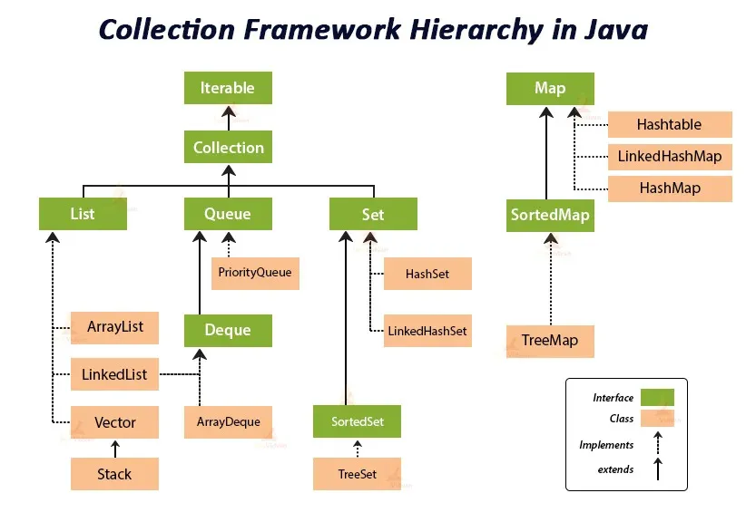
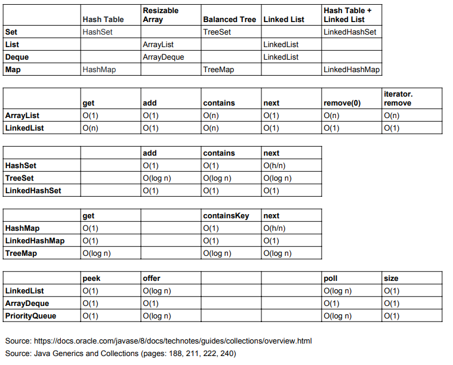

## Aula 31 - Collections

### Equals

- Quando se usar `==` a JVM não está comparando o valor do objeto, é sim da referência.
- `.equals` compara o valor do objeto.
- Existem regras definidas no método equals (está presente na documentação do método):
    - Reflexivo: `x.equals(x)` tem que ser true para tudo que for diferente de null.
    - Simétrico: para x e y diferentes de null, se `x.equals(y) == true`, logo  `y.equals(x) == true`.
    - Transitividade: para x,y,z diferentes de null, se `x.equals(y) == true`, logo `x.equals(z) == true`, logo `y.equals(z) == true`.
    - Consistente: `x.equals(x)` sempre retorna true se x for diferente de null.
    - para x diferentes de null, `x.equals(null)` tem que retornar false.

### hashCode

- hash é um valor numérico gerado para identificar um valor.
- Existem regras definidas no método hashCode:
    - se `x.equals(y) == true`, `y.hashCode() == x.hashCode()`.
    - `y.hashCode() == x.hashCode` não necessariamente o equals de `y.equals(x)` tem que ser true.
    - `y.hashCode() != x.hashCode()`, `x.equals(y)` deverá ser false.
- O atributo gera o equals tem que ser o mesmo que gera o hashCode para manter a consistência.

### Complexidade Big-O

- Collections no java é um grupo de dados divididos em diferentes classes que se enquadram em 2 categorias
    - Ordered  -> algo é ordenando quando a JVM lembra a ordem dos elementos
    - Sorted -> a ordem é baseada em algo pré definido

  

- Quando se trabalha com collection, se trabalha orientado a interface.
- Baseado na implementação que se está utilizando, se terá um diferença em performance.
- Big-O basicamente define a velocidade baseado no tipo de operação que se está fazendo.

https://www.bigocheatsheet.com/

- Quando se fala de Big-O sempre se olha o pior-caso (Worst-case).

  

- Quando se está trabalhando com collections tem que se ter cuidado com complexidade Big-O e cada coleção tem um tipo de complexidade para operação.

## List

- Um ArrayList é basicamente um array que pode ser dinamicamente incrementado.
- É uma lista ordenada
- No momento de criação de qualquer collection, o valor dentro da operador diamante (<>) tem que ser um objeto.
- Não se pode criar uma List com um valor primitivo;

## Sorting

- Exemplo: `ListSortTest`

**Comparable**

- Para ordenar classe customizada é necessário implementar a interface Comparable e sobreescrever o método compareTo da forma que queremos que seja ordenado.
- Exemplo: `MangaSortTest`

**Comparator**

- Essa interface tem o método compare e não se implementa na sua classe diretamente
- Exemplo: `MangaSortTest`

## Binary Search

- Forma de fazer busca que retorna a posição(Index) do elemento desejado, ou caso não seja encontrado, retorna (-(ponto de inserção) -1)
- Ele precisa que a lista já esteja ordenada.